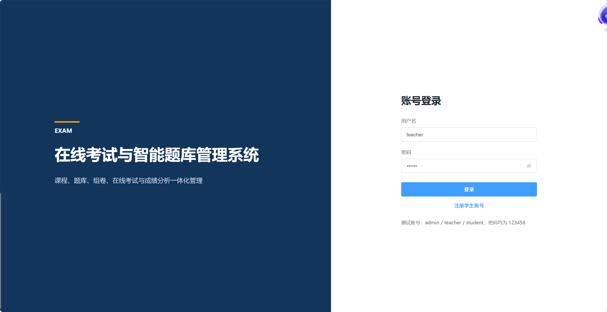
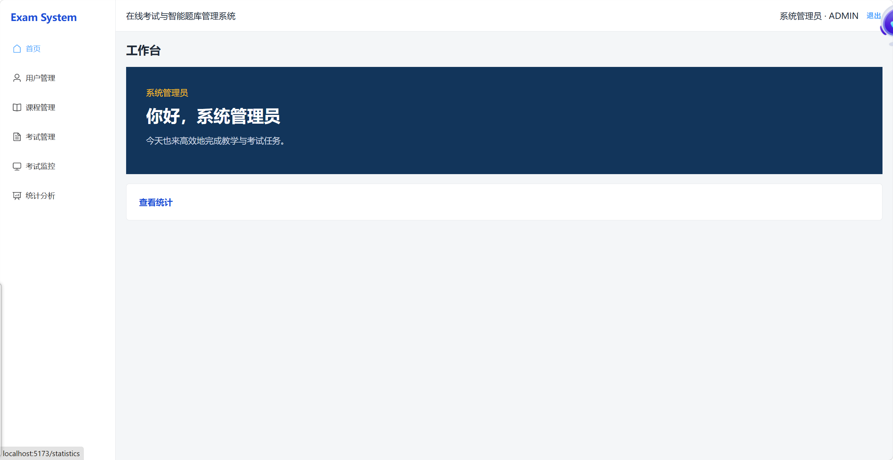
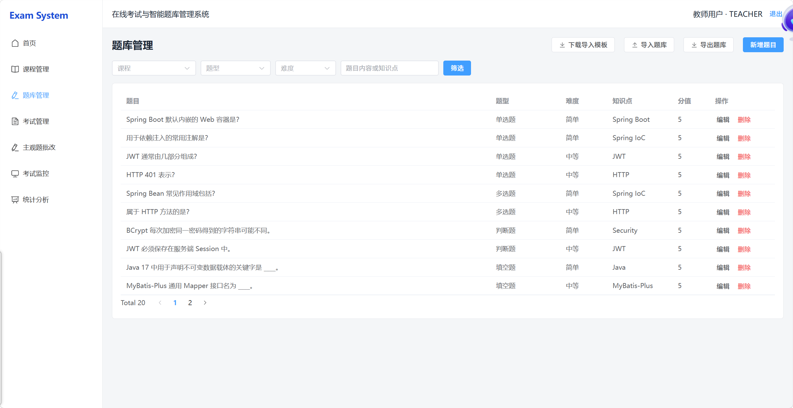
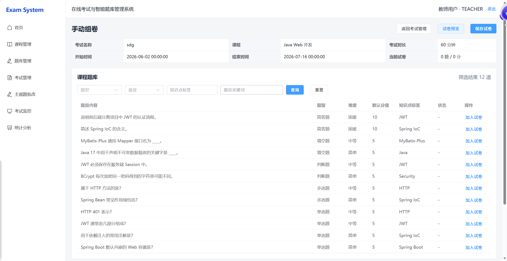
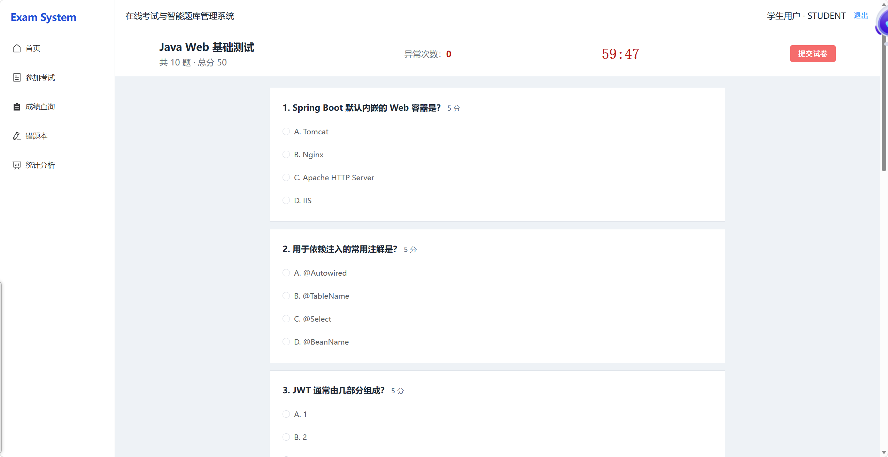
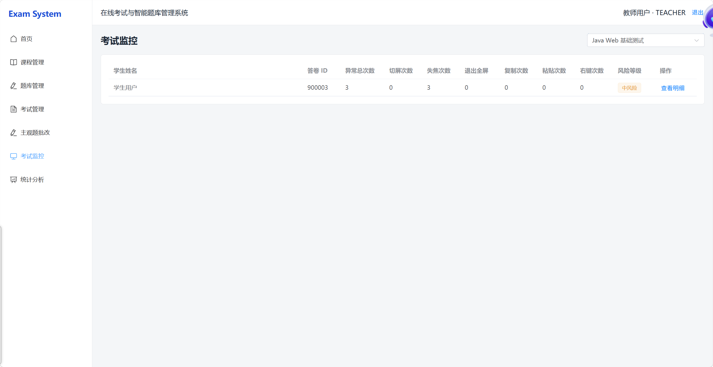
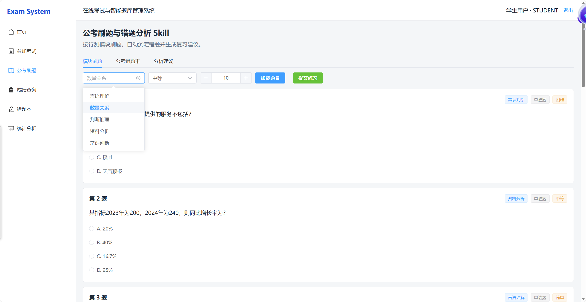
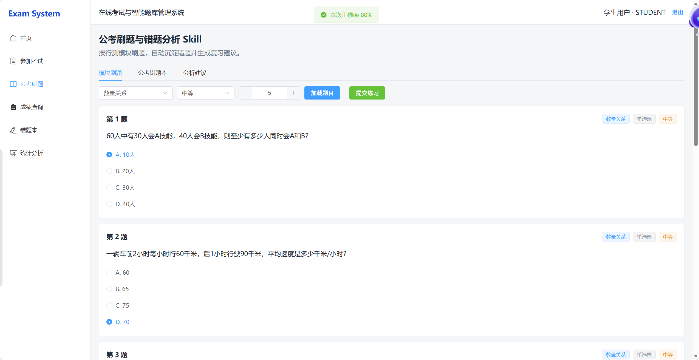
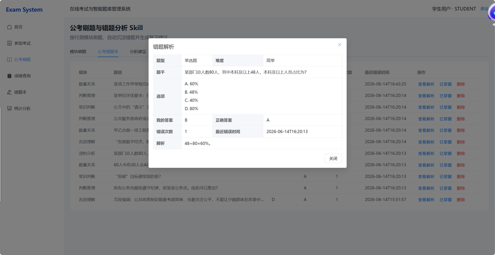
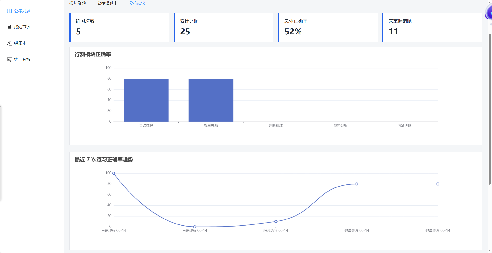

# 在线考试与智能题库管理系统

一个基于 Spring Boot 与 Vue 3 构建的前后端分离在线考试平台，面向管理员、教师和学生三类用户，覆盖题库维护、智能组卷、在线答题、自动判分、人工批改、成绩分析和考试防作弊监控等完整业务流程。

本项目适合作为 Java Web 课程设计、毕业设计基础项目及 Java 后端开发简历项目。

## 技术栈

### 后端

| 技术 | 用途 |
| --- | --- |
| Spring Boot | Web 应用与业务服务基础框架 |
| Spring Security | 身份认证与角色权限控制 |
| JWT | 无状态登录认证 |
| MyBatis-Plus | 数据访问与分页查询 |
| MySQL | 业务数据存储 |
| Apache POI | Excel 题库导入、导出与模板生成 |
| Maven | 依赖管理与项目构建 |

### 前端

| 技术 | 用途 |
| --- | --- |
| Vue 3 | 前端应用框架 |
| Vite | 开发服务器与生产构建 |
| Element Plus | 页面组件与交互反馈 |
| Vue Router | 页面路由与访问控制 |
| Pinia | 登录状态与用户信息管理 |
| Axios | HTTP 请求封装 |
| ECharts | 成绩统计与数据可视化 |

## 功能模块

### 用户与权限

- 管理员、教师、学生三角色权限体系
- 用户注册、登录、JWT 鉴权
- 当前用户信息查询
- 用户启用与禁用
- 前端菜单与路由权限控制

### 题库管理

- 题目新增、编辑、删除与分页查询
- 按课程、题型、难度、知识点和关键词筛选
- 支持单选题、多选题、判断题、填空题和简答题
- Excel 导入模板下载
- Excel 批量导入与筛选导出
- 导入数据逐行校验与错误行提示
- 数据库重复题目及 Excel 文件内重复题目检测

### 试卷与考试

- 教师创建、发布和关闭考试
- 按题型、难度比例自动随机组卷
- 从课程题库手动选择题目组卷
- 调整试题顺序与试卷分值
- 完整试卷预览，展示题目、选项、答案和解析
- 发布后锁定试卷内容

### 学生答题与判分

- 学生查看可参加考试并开始答题
- 在线考试倒计时
- 单选、多选、判断和填空题自动判分
- 简答题进入教师人工批改流程
- 防止重复提交
- 成绩与答题详情查询
- 错题自动记录与解析查看

### 公考刷题与错题分析 Skill

- 按言语理解、数量关系、判断推理、资料分析和常识判断模块专项刷题
- 自动记录公考错题、错误次数与最近错误时间，并支持查看完整题目解析
- 统计总体正确率及各模块正确率，帮助定位薄弱模块
- 根据练习结果、模块表现和未掌握错题生成针对性复习建议

### 批改与统计

- 教师查询待批改答卷
- 简答题评分与评语填写
- 批改完成后自动更新最终成绩
- 教师端考试平均分、最高分、最低分和参与人数统计
- 题目正确率与成绩分布分析
- 学生端考试次数、平均分、错题数量和成绩趋势统计
- ECharts 柱状图与折线图可视化

### 考试防作弊

- 记录切换页面、窗口失焦、退出全屏、复制、粘贴和右键等异常行为
- 前后端五秒重复上报限制
- 教师查看考试异常汇总与学生异常明细
- **加权风险评分**（0 起，按行为类型累计）与正常、低、中、高风险等级
- 监控页支持风险等级筛选与 30 秒自动刷新
- 异常监控不会自动交卷，不影响正常答题流程

### AI 与知识库

- **AI 出题**：按课程/题型/难度/知识点生成题目，教师审核后入库
- **AI 一键组卷**：按多条规则 AI 生成题目并写入草稿考试试卷
- **文档解析入库**：从 PDF/Word 提取题目预览，确认后入库
- **RAG 课程知识库**：上传资料、关键词检索、智能答疑与引用来源

### 工程化

- Docker Compose 启动 MySQL、Redis、后端与前端（本地开发也可只启数据库容器）
- Springdoc Swagger 与 Knife4j 接口文档（`/doc.html`）
- GitHub Actions CI（后端 `mvn test` + 前端 `npm run build`）
- 单元测试覆盖登录鉴权、考试权限、组卷、防作弊评分、RAG 等核心逻辑

## 项目优化说明

近期工程化优化重点：

- **教师权限边界**：考试创建者（`teacherId`）才可修改/组卷/发布；管理员可管理全部；监考教师仅可查看监控数据
- **CORS 配置**：通过 `app.cors.allowed-origins` / 环境变量 `CORS_ALLOWED_ORIGINS` 限制来源，不再默认 `*`
- **JWT 生产校验**：启用 `prod` profile 时，弱/默认 `JWT_SECRET` 将导致启动失败
- **统一异常状态码**：业务异常返回对应 HTTP 状态码；未知异常不向客户端暴露内部信息
- **核心测试**：补充考试越权、监考权限边界、学生题目脱敏、登录状态码、Review/Statistics 权限等用例

## 核心代码位置

| 模块 | 主要文件 |
| --- | --- |
| JWT 鉴权 | `security/JwtUtil.java`、`security/JwtAuthenticationFilter.java` |
| 权限控制 | `config/SecurityConfig.java`、`security/ExamAccessGuard.java`、`service/impl/ExamServiceImpl.java` |
| 考试管理 | `controller/ExamController.java`、`service/impl/ExamServiceImpl.java`、`service/impl/PaperServiceImpl.java` |
| 批改与统计 | `controller/ReviewController.java`、`controller/StatisticsController.java` |
| 防作弊监控 | `controller/ExamViolationController.java`、`service/impl/ExamViolationServiceImpl.java`、`monitor/ExamMonitorPublisher.java` |
| RAG 知识库 | `ai/knowledge/` 模块（文档上传、分片、检索、答疑） |
| 全局异常 | `exception/GlobalExceptionHandler.java` |
| CORS / JWT 校验 | `config/CorsConfig.java`、`config/JwtSecretValidator.java` |

## 部署注意事项

- 修改演示账号默认密码，不要使用 `123456` 上线
- 生产环境必须设置足够长度的随机 `JWT_SECRET`（启用 `prod` profile 时会校验）
- 通过 `CORS_ALLOWED_ORIGINS` 限制前端域名，不要使用 `*`
- 生产环境不要将 MySQL（3306）、Redis（6379）端口暴露到公网
- 不要将 `.env`、真实 API Key 或数据库密码提交到 Git 仓库

## 系统角色

| 角色 | 主要权限 |
| --- | --- |
| 管理员 | 用户管理、课程管理、考试管理、试卷预览、考试监控和统计分析 |
| 教师 | 课程管理、题库管理、自动/手动组卷、**仅管理自己创建的考试**、人工批改、考试监控和统计分析 |
| 学生 | 参加考试、在线答题、成绩查询、错题查看和个人统计 |

## 项目结构

```text
Online Exam and Intelligent Question Bank System
├── exam-system-backend
│   ├── src/main/java/com/exam/system
│   │   ├── common          # 统一响应对象
│   │   ├── config          # Security、跨域等配置
│   │   ├── controller      # REST API
│   │   ├── dto             # 请求数据对象
│   │   ├── entity          # 数据库实体
│   │   ├── exception       # 业务异常与全局异常处理
│   │   ├── mapper          # MyBatis-Plus Mapper
│   │   ├── security        # JWT 与登录认证
│   │   ├── service         # 业务接口
│   │   ├── service/impl    # 业务实现
│   │   └── vo              # 响应视图对象
│   ├── src/main/resources
│   │   ├── application.yml
│   │   ├── schema.sql
│   │   ├── data.sql
│   │   └── *-migration.sql
│   └── pom.xml
├── exam-system-web
│   ├── src
│   │   ├── api             # 前端接口封装
│   │   ├── layout          # 主页面布局
│   │   ├── router          # 路由与权限守卫
│   │   ├── store           # Pinia 状态管理
│   │   ├── utils           # Axios、枚举格式化等工具
│   │   └── views           # 业务页面
│   ├── package.json
│   └── vite.config.js
├── docs/images             # 项目截图
└── README.md
```

## 环境要求

- Java 17
- Maven 3.8+
- Node.js 18+
- MySQL 8
- npm 9+

## 数据库初始化

1. 确保 MySQL 8 已启动。
2. 进入 SQL 文件目录。
3. 登录 MySQL，并依次执行建表脚本和测试数据脚本。

```bash
cd exam-system-backend/src/main/resources
mysql -uroot -p --default-character-set=utf8mb4
```

进入 MySQL 命令行后执行：

```sql
SOURCE schema.sql;
SOURCE data.sql;
SOURCE civil-service-skill-migration.sql;
```

`schema.sql` 会创建 `exam_system` 数据库及项目所需数据表，`data.sql` 会写入演示账号、课程、题目和考试数据。

### 字符集与乱码（Windows / Docker）

MySQL 与 JDBC 需统一使用 `utf8mb4`，否则中文会出现乱码或双重编码。

**新库（推荐）**：使用 Docker Compose 启动 MySQL 时，已挂载 `docker/mysql/conf.d/charset.cnf` 与 `00-charset.sql`，`schema.sql` / `data.sql` 开头也包含 `SET NAMES utf8mb4`。

**已有库出现乱码时**，在 Windows 上请勿通过 PowerShell 管道执行 SQL（会破坏 UTF-8），应使用 `docker cp` 复制脚本后在容器内 `source`：

```powershell
docker cp exam-system-backend/src/main/resources/charset-seed-reload.sql exam-mysql:/tmp/charset-seed-reload.sql
docker exec exam-mysql mysql -uroot -p123456 --default-character-set=utf8mb4 -e "source /tmp/charset-seed-reload.sql"
```

若表/列字符集仍为 `latin1`，可再执行一次 `charset-repair.sql`（仅修复编码，不覆盖业务数据）。

后端 JDBC 连接串需包含 `useUnicode=true&characterEncoding=UTF-8&connectionCollation=utf8mb4_unicode_ci`（见 `application.yml`），Hikari 连接池会执行 `SET NAMES utf8mb4`。

`civil-service-skill-migration.sql` 会动态查找或创建“公务员考试”课程，初始化公考练习、答题和错题分析表，并写入 25 道示例题。脚本按课程、题型和题干检测已有题目，可重复执行而不会重复插入示例数据。

已有数据库需要保留数据时，请根据实际功能增量执行迁移脚本：

```sql
SOURCE review-migration.sql;
SOURCE violation-migration.sql;
SOURCE civil-service-skill-migration.sql;
```

> 请使用本机 MySQL 密码登录。README 和代码仓库中不应保存生产数据库密码。

## 后端启动

进入后端目录：

```bash
cd exam-system-backend
```

通过环境变量设置当前终端使用的 MySQL 密码。

PowerShell：

```powershell
$env:MYSQL_PASSWORD="你的本地MySQL密码"
mvn spring-boot:run
```

Windows CMD：

```bat
set MYSQL_PASSWORD=你的本地MySQL密码
mvn spring-boot:run
```

Linux 或 macOS：

```bash
export MYSQL_PASSWORD="你的本地MySQL密码"
mvn spring-boot:run
```

也可以先完成打包：

```bash
mvn clean package -DskipTests
java -jar target/exam-system-backend-1.0.0.jar
```

后端默认地址：`http://localhost:8080`

数据库密码由 `MYSQL_PASSWORD` 环境变量提供，具体配置可在 `application.yml` 中按本地环境调整。

## 前端启动

进入前端目录并安装依赖：

```bash
cd exam-system-web
npm install
npm run dev
```

前端默认地址：`http://localhost:5173`

Vite 开发服务器会将 `/api` 请求代理到 `http://localhost:8080`。

生产构建：

```bash
npm run build
```

## Docker Compose 一键部署

项目根目录提供 `docker-compose.yml`，包含 MySQL、Redis、后端和前端（Nginx 反代 API）。

1. 复制环境变量模板并按需修改：

```powershell
copy .env.example .env
```

2. 启动全部服务：

```powershell
docker compose up -d --build
```

3. 访问地址：

| 服务 | 地址 |
| --- | --- |
| 前端 | http://localhost:5173 |
| 后端 API | http://localhost:8080 |
| Swagger UI | http://localhost:8080/swagger-ui.html |
| Knife4j | http://localhost:8080/doc.html |

首次启动会自动执行 `schema.sql`、`data.sql`、公考迁移、**违规记录迁移**和**知识库迁移**。

Docker 环境下 Redis 默认启用（`REDIS_ENABLED=true`）。AI 功能通过 `.env` 中的 `AI_PROVIDER`、`OPENAI_API_KEY` 等变量配置；未配置 Key 时使用 Mock 模式。

停止服务：

```powershell
docker compose down
```

## 接口文档

后端集成 Springdoc OpenAPI 与 Knife4j：

- Swagger UI：`http://localhost:8080/swagger-ui.html`
- Knife4j 文档：`http://localhost:8080/doc.html`

除登录/注册外，其余接口需在 Knife4j 或 Swagger 页面点击 **Authorize**，填入 `Bearer <JWT Token>`。

## 默认测试账号

测试账号的登录密码均为 `123456`。

| 角色 | 用户名 | 主要用途 |
| --- | --- | --- |
| 管理员 | `admin` | 用户管理与系统级功能验收 |
| 教师 | `teacher` | 题库、组卷、考试、批改与监控 |
| 学生 | `student` | 在线考试、成绩与错题查询 |

> 测试账号仅用于本地开发和课程演示，部署前请修改默认密码。

## 核心业务流程

### 教师出题与组卷

```text
维护课程
  → 新增题目或通过 Excel 批量导入
  → 筛选课程题库
  → 自动组卷或手动选题组卷
  → 调整题目顺序与分值
  → 预览完整试卷
  → 发布考试
```

### 学生考试与成绩

```text
查看可参加考试
  → 开始考试
  → 在线答题与倒计时
  → 提交试卷
  → 客观题自动判分
  → 简答题等待教师批改
  → 查看最终成绩、答题详情与错题
```

### 教师批改与分析

```text
查看待批改答卷
  → 为简答题评分并填写评语
  → 系统重新计算总分
  → 查看成绩分布与题目正确率
  → 查看考试异常行为与风险等级
```

## 项目截图

> 将实际截图放入 `docs/images` 目录后，以下图片会自动显示。

### 登录与工作台





### 题库与组卷






### 考试与批改




### 统计与监控




### 公考刷题与错题分析 Skill

按行测模块选择题目并进行专项练习。



提交练习后查看正确率、答题结果与题目解析。



在公考错题本中查看个人答案、正确答案和详细解析。



通过模块正确率和最近练习趋势分析薄弱环节。



## 项目亮点

- 完整覆盖“题库、组卷、发布、答题、判分、批改、统计”的考试业务闭环
- Spring Security 与 JWT 实现前后端分离的角色权限控制
- Excel 导入采用逐行校验，支持部分成功、错误定位和重复题目检测
- 自动组卷支持题型数量及难度比例配置，并提供题库不足的明确提示
- 手动组卷支持课程隔离、题目排序、自定义分值和发布后锁定
- 客观题自动判分与主观题人工批改协同，确保成绩状态准确
- 前后端双重异常上报限制与考试风险等级统计
- ECharts 展示成绩分布、题目正确率和学生成绩趋势
- 公考专项模块覆盖模块化刷题、错题解析、错误频次追踪和掌握状态管理
- 公考分析按模块统计正确率并识别薄弱项，结合练习数据自动生成复习建议
- 统一响应、业务异常处理和前端枚举格式化，降低前后端耦合

## 后续优化方向

- RAG 接入 Milvus / pgvector 等专用向量数据库（当前为 MySQL JSON + 内存余弦相似度）
- 题目图片、公式和富文本编辑支持
- 完整 E2E 联调测试（`E2E_WITH_BACKEND=1 npm run test:e2e`）
- 操作日志审计与敏感配置集中管理

## 版本管理

项目使用 Git 和 GitHub 进行版本管理。建议按功能创建分支，通过清晰的提交信息记录题库、考试、批改、统计等模块的开发过程。

## License

本项目主要用于课程学习、技术交流和个人项目展示。

## AI 出题功能

教师端题库管理页新增“AI 出题”入口。教师选择课程、题型、难度、知识点、生成数量、每题分值和额外要求后，可以先生成题目预览；预览中的题干、选项、答案、解析、难度、分值和知识点均可编辑。AI 生成内容不会直接入库，必须由教师确认后点击“保存入题库”才会批量写入现有 `question` 表。

### 接口说明

- `POST /api/ai/questions/generate`：生成题目预览，不入库。
- `POST /api/ai/questions/save`：保存教师确认后的 AI 题目到题库。

两个接口均要求登录，并且只允许 `ADMIN`、`TEACHER` 访问，`STUDENT` 访问会返回 403。

### Mock 模式

默认配置为 mock 模式，无需大模型 API Key 即可演示完整前后端流程：

```yaml
ai:
  provider: mock
```

也可以通过环境变量指定：

```powershell
$env:AI_PROVIDER="mock"
```

### 配置真实大模型

后端支持 **OpenAI 兼容接口**（含 DeepSeek），API Key 不写入代码，优先从环境变量读取：

```powershell
$env:AI_PROVIDER="openai"
$env:OPENAI_API_KEY="你的 API Key"
$env:OPENAI_BASE_URL="https://api.deepseek.com/v1"
$env:OPENAI_MODEL="deepseek-chat"
```

也可复制 `.env.example` 为 `.env` 后执行 `.\start-dev-with-ai.ps1` 启动后端。

`application.yml` 中的默认配置如下，没有 Key 或 provider 不是 `openai` 时会自动使用 Mock：

```yaml
ai:
  provider: ${AI_PROVIDER:mock}
  openai:
    api-key: ${OPENAI_API_KEY:}
    base-url: ${OPENAI_BASE_URL:https://api.openai.com/v1}
    model: ${OPENAI_MODEL:gpt-4o-mini}
```

### 教师端使用流程

1. 使用教师或管理员账号登录。
2. 进入“题库管理”，点击“AI 出题”。
3. 填写课程、题型、难度、知识点、数量、分值和额外要求。
4. 点击“生成题目”，检查并编辑预览列表。
5. 删除不需要的题目，确认无误后点击“保存入题库”。

## AI 课程知识库答疑

本项目新增轻量级 RAG 课程知识库答疑功能，适合课程资料规模较小、需要稳定演示的场景。第一版不引入 Milvus、Elasticsearch、LangChain 或向量数据库，而是将课程资料解析为数据库文本片段，通过关键词文本相似度检索相关 chunk，再把“用户问题 + 相关片段”交给后端 AI 模型生成答案。

### 功能说明

- 教师和管理员可按课程上传资料。
- 系统解析文档文本并切分为 chunk，保存到数据库。
- 学生、教师和管理员都可以选择课程提问。
- 后端只检索当前课程下的相关片段，不会把全库内容拼给 AI。
- 如果未检索到足够依据，系统直接返回“当前课程资料中未找到足够依据，请补充资料或换个问题。”，不调用真实 AI，避免模型编造。
- 答案会展示引用来源和相关片段预览。

### 支持文件类型

- PDF：使用 Apache PDFBox 解析文字型 PDF，不包含 OCR。
- DOCX：使用 Apache POI XWPFDocument 解析段落文本。
- TXT / MD：按 UTF-8 文本读取。
- 单文件大小限制：10MB。

### 数据库 Migration

新增 migration 文件：

```sql
SOURCE ai-knowledge-migration.sql;
```

新增表：

- `course_knowledge_document`：课程资料主表。
- `course_knowledge_chunk`：课程资料文本片段表。

在已有数据库中执行：

```bash
cd exam-system-backend/src/main/resources
mysql -uroot -p --default-character-set=utf8mb4 exam_system
```

然后执行：

```sql
SOURCE ai-knowledge-migration.sql;
```

### 接口列表

- `POST /api/ai/knowledge/documents`：上传课程资料，`ADMIN`、`TEACHER` 可用。
- `GET /api/ai/knowledge/documents?courseId=xxx`：查询课程资料列表，三类角色可用。
- `DELETE /api/ai/knowledge/documents/{id}`：删除资料并同步删除 chunk，`ADMIN`、`TEACHER` 可用。
- `POST /api/ai/knowledge/ask`：课程知识库答疑，三类角色可用。

### 使用流程

1. 管理员或教师进入“课程知识库”。
2. 选择课程，填写资料标题，上传 PDF/DOCX/TXT/MD。
3. 系统解析并显示文档列表和片段数量。
4. 学生、教师或管理员在答疑区输入问题。
5. 系统展示 AI 回答、引用文档、片段序号、相关度分数和内容预览。

### 向量语义检索（v2）

第二版检索采用 **关键词 + 向量混合排序**（默认权重：向量 65% / 关键词 35%）：

1. 上传资料时为每个 chunk 生成 embedding 并存入 `embedding_json`。
2. 提问时对问题做 embedding，与 chunk 计算余弦相似度。
3. 与关键词得分归一化后合并，返回 top-K 片段。

配置（`.env` 或环境变量）：

```powershell
$env:AI_EMBEDDING_ENABLED="true"
$env:AI_EMBEDDING_PROVIDER="mock"    # mock | openai
$env:AI_EMBEDDING_MODEL="text-embedding-3-small"
```

> DeepSeek 对话 API 不提供 embedding 时，建议 `AI_EMBEDDING_PROVIDER=mock`；若使用 OpenAI embedding 接口，可设为 `openai` 并配置 `OPENAI_API_KEY`。

已有数据库请执行：

```sql
SOURCE ai-knowledge-vector-migration.sql;
```

### 实时监考 WebSocket

学生上报异常行为后，后端通过 STOMP 推送到 `/topic/exam/{examId}/monitor`。教师「考试监控」页自动订阅并实时更新对应学生的风险评分，同时保留 30 秒轮询作为兜底。

- SockJS 端点：`/ws`
- 订阅主题：`/topic/exam/{examId}/monitor`
- 鉴权：CONNECT 帧携带 `Authorization: Bearer <JWT>`

### E2E 自动化测试

前端使用 Playwright：

```bash
cd exam-system-web
npm install
npx playwright install chromium
npm run test:e2e
```

联调后端与数据库时：

```bash
E2E_WITH_BACKEND=1 npm run test:e2e
```

**Windows 下 Chromium 下载失败时**

若 `npx playwright install chromium` 因网络超时失败，可改用本机已安装的浏览器（无需下载 Playwright 自带 Chromium）：

```powershell
# 使用本机 Google Chrome
$env:E2E_BROWSER_CHANNEL="chrome"
npm run test:e2e

# 或使用本机 Microsoft Edge
$env:E2E_BROWSER_CHANNEL="msedge"
npm run test:e2e
```

仍想安装 Playwright Chromium 时，可通过代理下载（将地址替换为你的代理）：

```powershell
$env:HTTPS_PROXY="http://127.0.0.1:7897"
npx playwright install chromium
```

未设置 `E2E_BROWSER_CHANNEL` 时，默认使用 Playwright 自带 Chromium；CI 环境仍按此方式安装并运行。

### AI 一键组卷

草稿状态考试在「考试管理」页点击 **AI 组卷**，可配置多条出题规则（题型、难度、数量、分值）。系统会 AI 生成题目、写入题库并组装试卷，完成后可在试卷预览中调整。

接口：`POST /api/ai/questions/generate-paper`

### 文档解析入库

「题库管理」页点击 **解析文档**，上传 PDF/DOCX 后 AI 提取题目预览，教师确认后保存入库。

接口：`POST /api/ai/questions/parse-document`

### Mock 模式

默认 `ai.provider=mock`。Mock 模式不会调用外部 API，也可以完整演示上传资料、检索片段、生成答疑和显示引用来源流程。

### OpenAI 模式配置

```powershell
$env:AI_PROVIDER="openai"
$env:OPENAI_API_KEY="你的 API Key"
$env:OPENAI_MODEL="gpt-4o-mini"
$env:OPENAI_BASE_URL="https://api.openai.com/v1"
```

API Key 只在后端读取，不会返回给前端，也不会写死在代码里。

### 注意事项

- 第一版采用数据库文本片段检索，暂未接入 Embedding 和向量数据库。
- 适合课程资料较少、演示和课程设计场景。
- 后续可升级为 Embedding + 向量数据库，提高语义检索能力。
