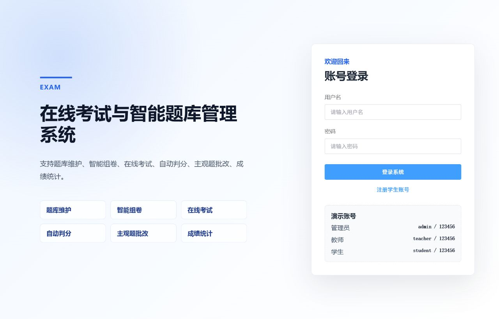
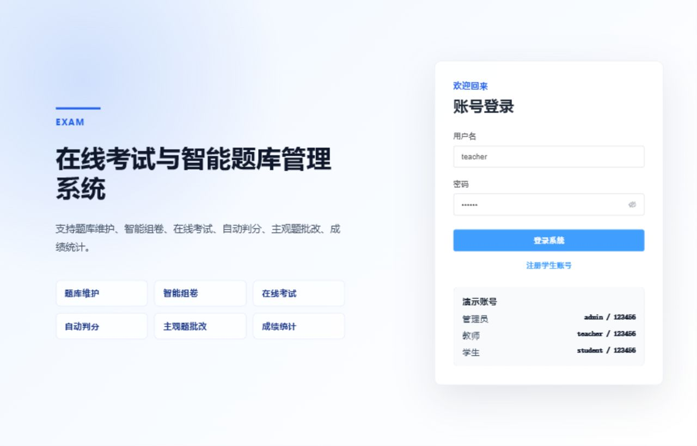
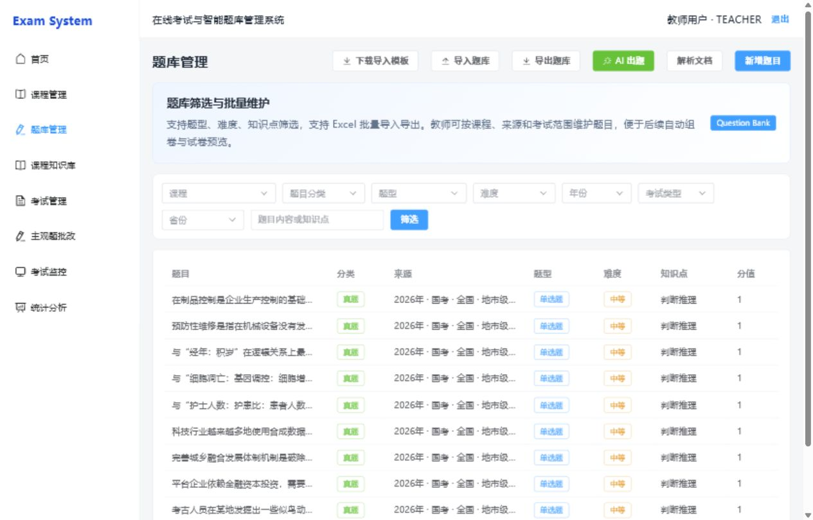
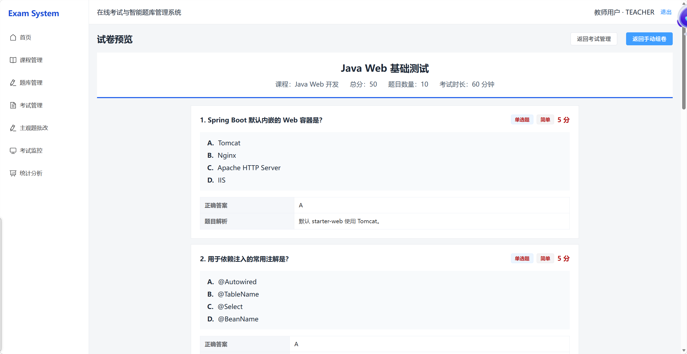
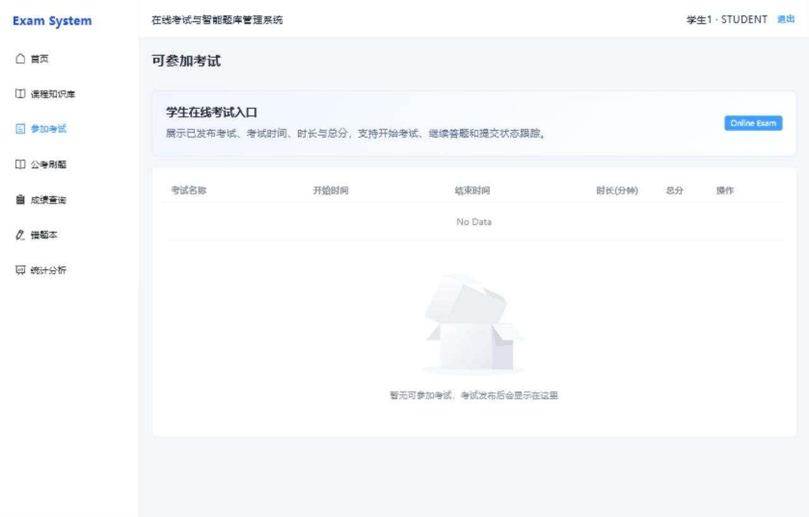
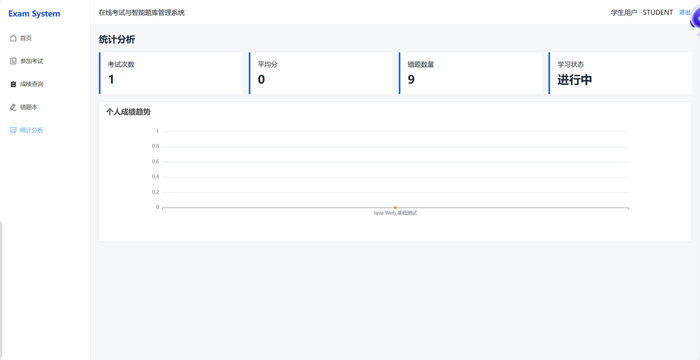
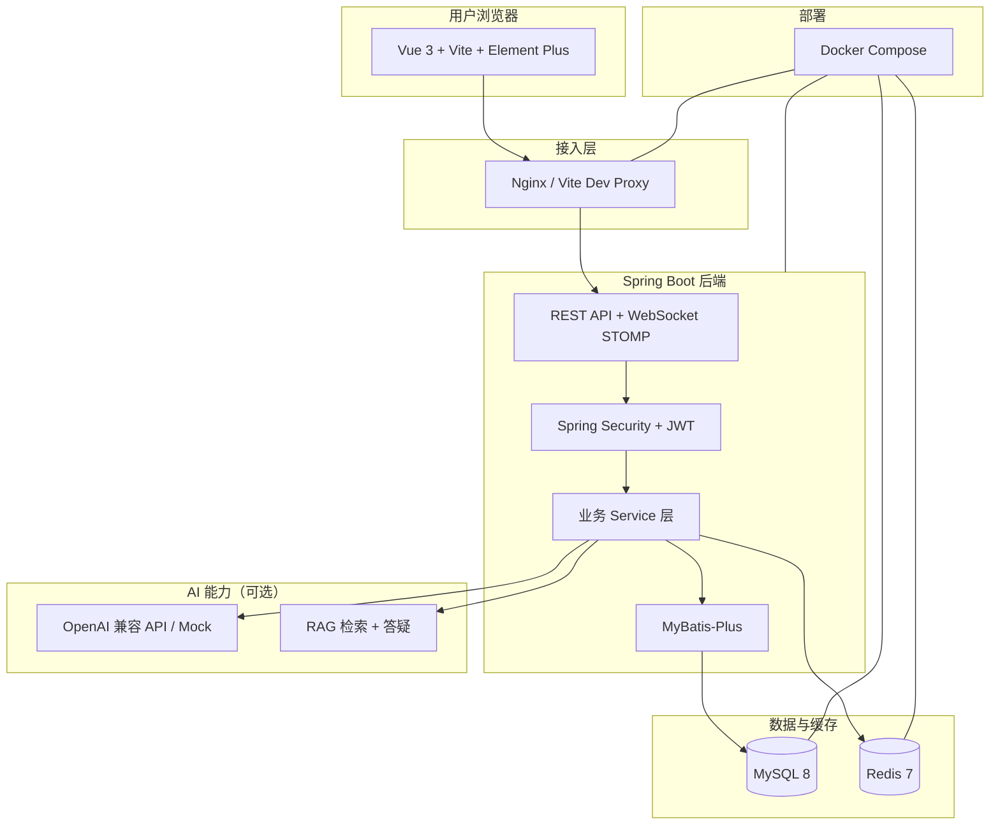
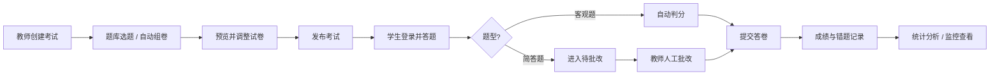
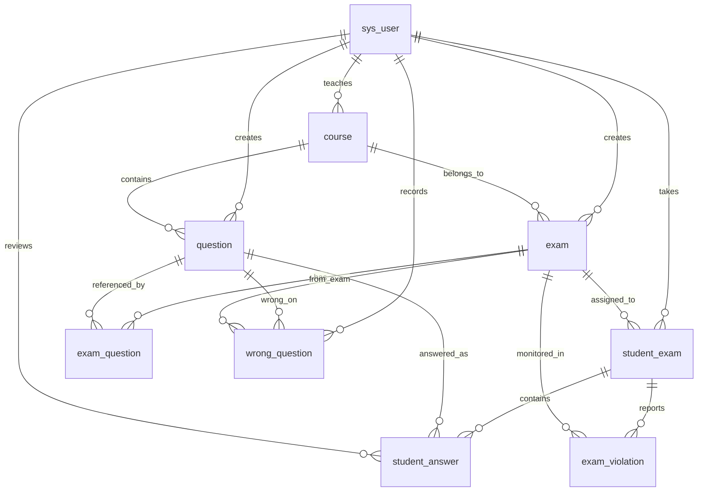

# 在线考试与智能题库管理系统


一个基于 Spring Boot 与 Vue 3 构建的前后端分离在线考试平台，面向管理员、教师和学生三类用户，覆盖题库维护、智能组卷、在线答题、自动判分、人工批改、成绩分析和考试防作弊监控等完整业务流程。

本项目适合作为 Java Web 课程设计、毕业设计基础项目及 Java 后端开发简历项目。面试答辩可参考 [docs/interview-guide.md](docs/interview-guide.md)。

## 项目预览

| 登录页 | 教师工作台 |
| --- | --- |
|  |  |

| 题库管理 | 试卷预览 |
| --- | --- |
|  |  |

| 学生答题 | 成绩统计 |
| --- | --- |
|  |  |

## 快速导航

- [本地运行指南](docs/run-guide.md)
- [演示指南与面试讲解](docs/demo-guide.md)
- [数据库设计说明](docs/database-design.md)
- [面试答辩指南](docs/interview-guide.md)
- [项目截图目录](docs/screenshots)
- [数据库建表脚本](exam-system-backend/src/main/resources/schema.sql)
- [演示数据脚本](exam-system-backend/src/main/resources/data.sql)

## 演示账号

演示账号来自 `exam-system-backend/src/main/resources/data.sql`，默认密码均为 `123456`。

| 角色 | 用户名 | 密码 | 可演示功能 |
| --- | --- | --- | --- |
| 管理员 | `admin` | `123456` | 用户管理、课程管理、考试管理、数据查看 |
| 教师 | `teacher` | `123456` | 题库维护、组卷、主观题批改、成绩统计 |
| 学生 | `student` | `123456` | 在线答题、查看成绩、错题记录 |

## 一分钟运行流程

本仓库已提供 `docker-compose.yml` 和 `.env.example`，可优先使用 Docker Compose 运行；也可按 [本地运行指南](docs/run-guide.md) 使用本地 MySQL + Maven + Vite 启动。

```powershell
copy .env.example .env
docker compose up -d --build
```

访问地址：`http://localhost:5173`。更完整的启动、排查和演示步骤见 [本地运行指南](docs/run-guide.md) 与 [演示指南](docs/demo-guide.md)。

## 项目亮点总览

- **三角色权限体系**：管理员 / 教师 / 学生，JWT + Spring Security，考试与题目按创建者隔离
- **在线考试闭环**：创建考试 → 组卷 → 发布 → 答题 → 判分 → 批改 → 统计
- **题库导入导出**：Excel 模板、逐行校验、重复检测，支持多题型与课程维度筛选
- **主观题批改**：简答题人工评分，批改完成后自动汇总最终成绩
- **防作弊监控**：前端行为上报 + 加权风险评分 + WebSocket 实时推送
- **AI 出题 / RAG 知识库**：AI 生成题目审核入库；MySQL 片段 + embedding 混合检索答疑
- **数据库设计可讲解**：用户、课程、题库、试卷、答卷、批改、错题和异常监控分表设计，详见 [数据库设计说明](docs/database-design.md)
- **Docker 部署与测试**：开发/生产 Compose 分离，57+ 单元测试 + CI + Playwright smoke E2E

## 系统架构说明



## 核心业务流程



## 数据库核心表关系



> 更详细的字段、约束、索引和状态设计见 [docs/database-design.md](docs/database-design.md)。
